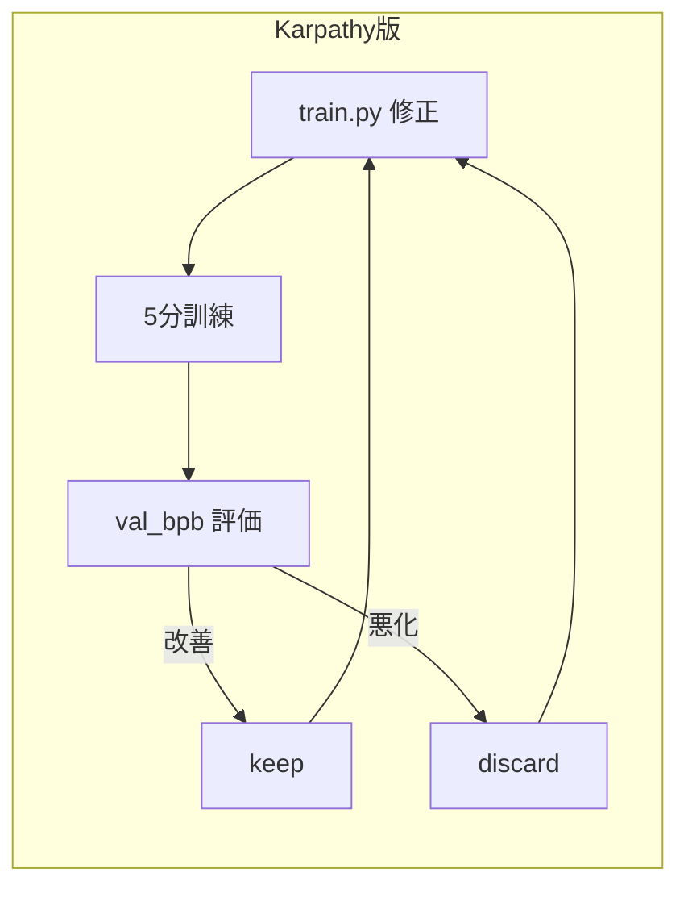
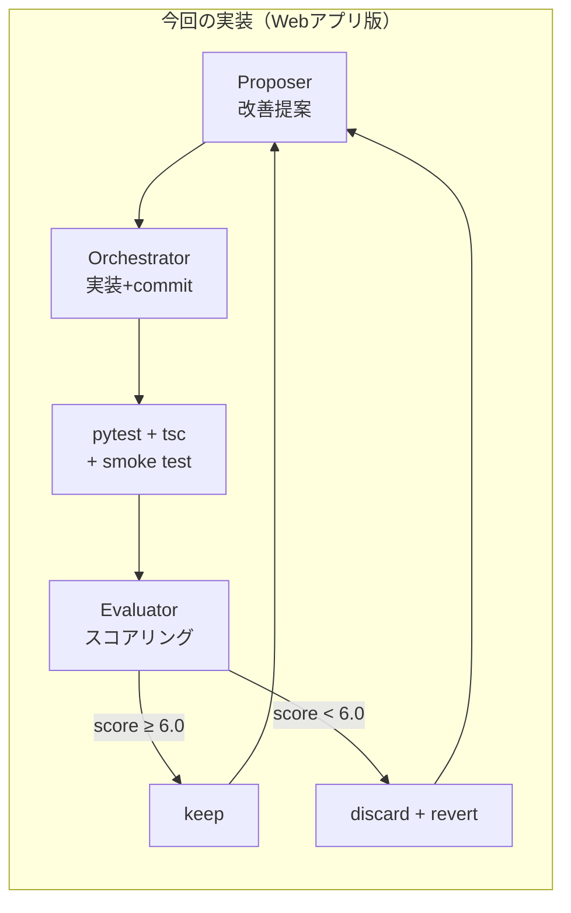
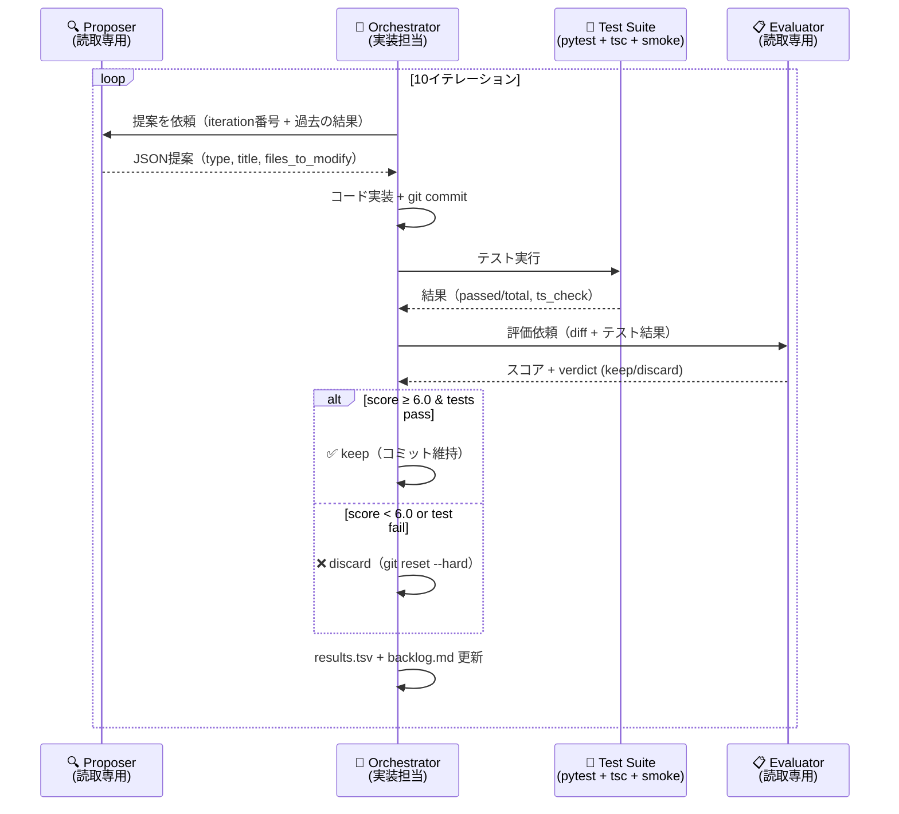
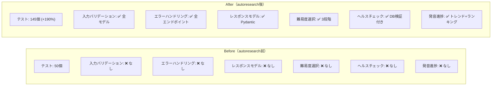
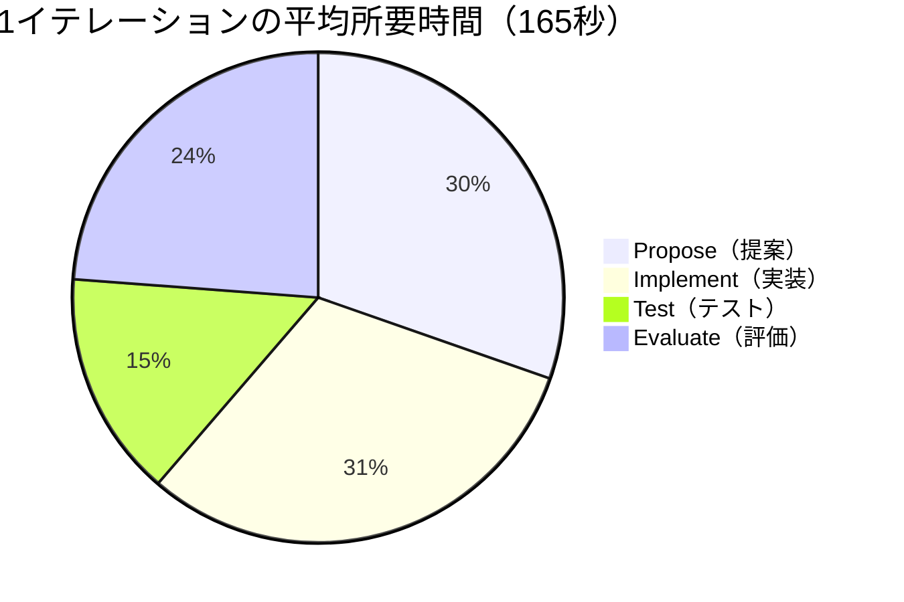
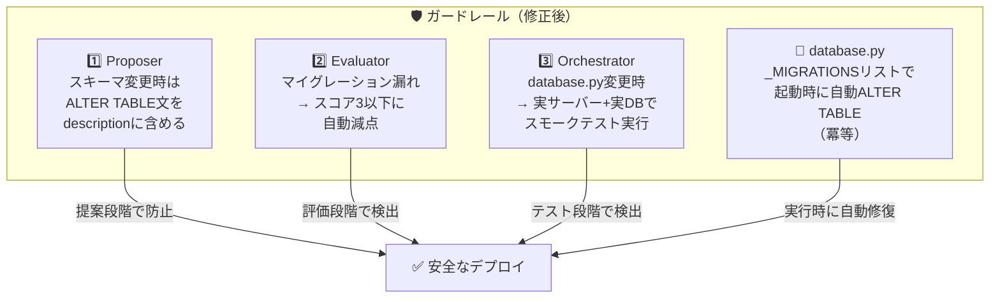

# 「寝ている間にアプリが進化する」— Karpathyのautoresearchを英語学習アプリで実践してみた

## はじめに — autoresearchとの出会い

「数理の弾丸⚡️京大博士のAI解説」というYouTubeチャンネルの「[無限に試行錯誤を続けるAIエージェント【autoresearch】](https://www.youtube.com/watch?v=u8nSQnoJJBw)」という動画で、Andrej Karpathyの**autoresearch**が紹介されているのを見つけました。

元のリポジトリはこちらです：

- 📦 [karpathy/autoresearch (GitHub)](https://github.com/karpathy/autoresearch)

autoresearchとは、LLMの訓練コード（`train.py`）を1ファイルだけエージェントに渡し、「5分間訓練→結果を見る→コードを修正→また訓練」のループを**完全自律で**回し続けるという実験です。人間が寝ている間に100回の実験が終わり、朝起きたら改善されたモデルが手に入ります。

これを見て思いました。**「これ、普通のWebアプリ開発にも使えるのでは？」** と。

ちょうど自分が作りかけの英語学習アプリがありました。テストは少ない、入力バリデーションは甘い、エラーハンドリングもない。課題は山積みですが、一つずつ手で直す時間はありません。ならば、エージェントに「提案→実装→テスト→評価」のループを回させてみようと考えました。

## 対象アプリの紹介

AIを使った英語学習アプリで、**listening**と**speaking**にフォーカスしています。

- 🗣️ **会話練習** — ホテル、レストラン、面接など6つのシナリオでAIとロールプレイ
- 🎙️ **発音練習** — シャドーイングで発音精度とフルエンシーをスコアリング
- 📝 **語彙クイズ** — AI生成の4択クイズ + SM-2間隔反復で定着
- 📊 **ダッシュボード** — 学習ストリーク、スコア推移、マスター単語数を可視化

テック構成はFastAPI + React + TypeScript + SQLite + GitHub Copilot SDK（Claude Sonnet 4）です。

autoresearch実行前の状態は、テスト50個、入力バリデーションなし、LLMエラーハンドリングなしという状況でした。

## autoresearchの仕組み — Webアプリ向けに再設計

Karpathyのautoresearchは「1ファイルを修正して5分訓練」というシンプルな構造です。Webアプリに適用するにあたり、以下のように再設計しました。

### Karpathy版との比較





| | Karpathy版 | 今回の実装 |
|---|---|---|
| 対象 | `train.py`（1ファイル） | Webアプリ全体（バックエンド + フロントエンド） |
| 評価指標 | val_bpb（数値1つ） | pytestパス率 + TypeScriptコンパイル + LLMスコア |
| ループ回数 | 無限 | 10イテレーション |
| 実行環境 | Claude/Codex + GPU | VS Code Copilot エージェント |
| 成果管理 | `results.tsv` | `results.tsv` + `backlog.md` + `summary.md` |
| エージェント数 | 1つ | 3つ（proposer / orchestrator / evaluator） |

### エージェント構成

VS Code Copilotのカスタムエージェント機構（`.agent.md`）を使い、3つの役割を分離しました。



### 各MDファイルの役割

| ファイル | 役割 | ツール権限 | 説明 |
|---------|------|-----------|------|
| `orchestrator.agent.md` | 🔧 **司令塔** | read, edit, execute, agent | ループ全体を駆動します。propose→implement→commit→test→evaluate→keep/discardの各ステップを実行し、タイミングをT0〜T4の5チェックポイントで記録します |
| `proposer.agent.md` | 🔍 **提案者** | read, search | コードベースを分析して改善提案を1つだけJSON形式で返します。過去のresults.tsvを参照して重複提案を回避します |
| `evaluator.agent.md` | 📋 **審査官** | read, search | git diff + テスト結果を受け取り、コード品質(30%)・機能価値(30%)・保守性(40%)の3軸でスコアリングします。6.0/10以上でkeep判定です |
| `autoresearch.prompt.md` | 🚀 **エントリーポイント** | — | `/autoresearch` スラッシュコマンドでorchestratorを起動します |
| `copilot-instructions.md` | 📖 **プロジェクト規約** | — | テック構成、コーディング規約、テストコマンド、DBマイグレーションルールなど。全エージェントのコンテキストに自動で読み込まれます |

**ポイント**: proposerとevaluatorは**読み取り専用**で、ファイル編集やコマンド実行ができません。これにより「提案する人」「実装する人」「評価する人」の責務が明確に分離されます。Karpathyのオリジナルでは1つのエージェントがすべてを担いますが、Webアプリは変更対象が多岐にわたるため、役割分離が有効でした。

### ループの開始方法

VS Code Copilot Chatで以下を入力するだけです：

```
/autoresearch
```

あとはorchestratorが自律的に10イテレーションを回し、完了後に`autoresearch/summary.md`にレポートを生成します。

## 10イテレーションの結果

31分間で10イテレーション、**全て成功（keep率100%）** という結果になりました。

### イテレーション別の結果

| # | Score | 種類 | 所要時間 | 内容 |
|---|-------|------|---------|------|
| 1 | 8.4 | test | 146s | 会話DALのユニットテスト19件追加 |
| 2 | 8.4 | test | 138s | 発音DALのユニットテスト15件追加 |
| 3 | 8.4 | test | 123s | 語彙DALのユニットテスト24件追加 |
| 4 | 7.7 | test+bugfix | 140s | Pydantic入力バリデーション + 15テスト |
| 5 | 7.3 | bugfix | 189s | LLMエラーハンドリング + 5テスト |
| 6 | 8.0 | **feature** | 247s | **🆕 会話の難易度選択（Beginner / Intermediate / Advanced）** |
| 7 | 8.1 | refactor | 172s | ダッシュボードDAL分離（90行→22行） |
| 8 | 7.7 | refactor | 197s | Pydanticレスポンスモデル全追加 |
| 9 | 7.7 | **feature** | 148s | **🆕 ヘルスチェックエンドポイント** |
| 10 | 7.7 | **feature** | 209s | **🆕 発音進捗追跡エンドポイント** |

### Before / After 比較



| 指標 | Before | After |
|------|--------|-------|
| テスト数 | 50 | 145 (**+190%**) |
| 入力バリデーション | なし | 全リクエストモデルに適用 |
| LLMエラーハンドリング | なし | 全エンドポイントで502返却 |
| レスポンスモデル | なし | 全エンドポイントにPydanticモデル |
| 新機能 | — | **難易度選択、ヘルスチェック、発音進捗** |
| 所要時間 | — | 約**31分** |
| 平均スコア | — | **7.94/10** |

### イテレーション時間の内訳



特筆すべきは、テスト追加やリファクタリングだけでなく、**会話の難易度選択**（Beginner / Intermediate / Advanced）というユーザー向けの新機能もフルスタック（DB + API + フロントエンドUI）で自動実装された点です。

proposerがbacklogを読んで優先度を判断し、テスト強化が一段落したら自律的に機能追加に移行しました。「テストを書く」「バグを直す」「機能を作る」——これらを適切な順序で判断して実行できることが、単なるコード生成とautoresearchの本質的な違いです。

## うまくいかなかったこと — スキーマ問題とその教訓

10イテレーション全てkeepで完璧に見えましたが、**実は本番環境で動かない**という問題が発覚しました。

### 何が起きたか

イテレーション#6で`conversations`テーブルに`difficulty`カラムを追加しました。テストは全パス。evaluatorも8.0点でkeep。

しかし、実際にブラウザでシナリオを選ぶと **"Failed to start conversation"** エラーが発生します。

原因を調べると：

```
sqlite3.OperationalError: table conversations has no column named difficulty
```

テストはインメモリDBを毎回新規作成するため、新しいスキーマが常に適用されます。しかし本番の`data/english_app.db`は**古いスキーマのまま**で、`CREATE TABLE IF NOT EXISTS`は既存テーブルを更新しません。

### なぜ防げなかったか — 最大の原因は「成果物レベルのテスト」の欠如

この問題の最も大きな原因は、**実際のDBファイルを使った成果物レベルのユーザーテスト（E2Eテスト・スモークテスト）がループに組み込まれていなかった**ことです。

autoresearchのテストステップでは `pytest`（unit + integration）と `tsc --noEmit`（TypeScript型チェック）を実行していましたが、これらはすべて**インメモリDBを毎回新規作成**して動きます。つまり、テスト環境では常に最新のスキーマが適用されるため、「既存のDBファイルに新しいカラムがない」という本番固有の問題を原理的に検出できませんでした。

もし実サーバーを起動して実際のDBに対してAPIを叩くスモークテストや、Playwrightで画面操作するE2Eテストがループに含まれていれば、`POST /api/conversation/start` が500エラーを返す時点で即座にdiscardされていたはずです。

この根本原因に加えて、以下の要因も重なりました：

1. **MDにルールがなかった** — orchestrator / proposer / evaluator のいずれにも「スキーマ変更時はALTER TABLEを含めよ」という指示がなく、エージェントがマイグレーションの必要性を認識できませんでした
2. **優先度の逆転** — backlogに「DBマイグレーション戦略」はありましたがLOW優先度で後回しにされ、そのインフラが整う前にスキーマ変更を伴う機能追加が先に実行されてしまいました

つまり、**エラー検知→修正のサイクルが回る仕組みがそもそもなかった**のが本質的な問題です。テストが全てパスしていたのは「正しいから」ではなく「検出できないから」に過ぎませんでした。

:::note warn
**教訓：エージェントは指示されていないことはやりません。特に「何をテストするか」のガードレール設計は、人間が事前に行う必要があります。テストがパスしたからといって、本番で動くとは限りません。**
:::

### 改善策 — 3重のガードレール

問題発見後、以下の3重ガードレールを追加しました。



1. **proposer** — 「スキーマ変更時はALTER TABLE文をdescriptionに含めよ」ルールを追加しました
2. **evaluator** — 「マイグレーション漏れはスコア3以下」ルールを追加しました
3. **orchestrator** — `database.py`や`routers/`が変更された場合、**実サーバー + 実DBでスモークテスト**（5エンドポイントの200チェック、LLM不要で5秒完了）を実行し、失敗したらdiscardするようにしました

加えて、`database.py`に自動マイグレーション機構（`_MIGRATIONS`リスト）を実装し、アプリ起動時に冪等にALTER TABLEを適用するようにしました。

なお、Playwrightで画面操作するフルE2Eテストをループに組み込むことも検討しましたが、サーバー起動＋ブラウザ起動＋LLM応答待ちで**1イテレーションあたり30〜60秒の追加**が見込まれ、10イテレーションで5〜10分の遅延になります。加えてLLMレスポンスの非決定性によるフレーキーテストのリスクもあるため、今回は軽量なスモークテスト（APIレベルの疎通確認）に留めました。ただし、`database.py`が変更されたイテレーションだけ条件付きでPlaywrightを実行する、といったアプローチは十分検討の余地があります。

## 今後の展望

### 可能性

autoresearchの本質は「エージェントのMD（指示書）を改善し続ければ、コードも改善され続ける」という点にあります。

今回は10イテレーションでしたが、理論上は**無限に回し続けられます**。寝ている間に100イテレーション回せば、朝起きたら大量の改善が完了している——Karpathyが言う「meat computersの時代は終わった」という世界観です。

テストやリファクタリングだけでなく、**会話の難易度選択**や**発音進捗追跡**のようなユーザー向け機能もフルスタックで自動実装できたことは、このアプローチの汎用性を示しています。backlogに「こんな機能がほしい」と書いておけば、エージェントが優先度を判断して実装してくれます。

### 現時点の課題と改善の余地

**エージェントの役割不足：**

現在のproposerはbacklogを読んで提案するだけですが、backlog自体を自律的に成長させる仕組みがありません。エラーログを監視してバグを自動登録する「monitor」エージェントや、ユーザーの学習パターンから機能提案を行う「analyst」エージェントがいれば、より自律的なシステムになるでしょう。

**評価の限界：**

evaluatorはLLMベースなので、今回のスキーマ問題のように**実行しなければわからないバグ**を見逃すことがあります。スモークテストの追加で一部対応しましたが、E2Eテスト（Playwright）の条件付き実行や、静的解析ツールとの組み合わせなど改善の余地があります。

**LLMコスト：**

各イテレーションでLLM呼び出しが複数回発生します（propose, implement, evaluate）。イテレーション数を増やせば増やすほどコストも増加していくため、長時間の自律実行ではコスト管理が課題になります。ただし、テスト追加やバグ修正が自動で行われることを考えると、人間のエンジニア工数との比較ではコスト効率は良いかもしれません。

**MDの品質がボトルネック：**

今回の失敗で明確になったのは、**エージェントの能力はMDの品質に完全に依存する**ということです。ルールが書かれていなければやりませんし、曖昧に書かれていれば曖昧に実行されます。逆に言えば、MDを磨き続ければエージェントも成長し続けます。この「MDを書く」行為自体をエージェントに任せる——evaluatorがorchestratorのMDに改善提案する——というメタループが実現できれば、真に自己改善するシステムに近づくのではないでしょうか。

## まとめ

- Karpathyのautoresearchは「AIに研究させる」思想ですが、**普通のWebアプリ開発にも応用できる可能性を感じました**
- VS Code Copilotのカスタムエージェント（`.agent.md`）で、propose / implement / test / evaluateの自律ループを構築しました
- **31分で145テスト、3機能追加、2リファクタリング**が全自動で完了しました
- テストやリファクタリングだけでなく、**会話の難易度選択**のようなフルスタック新機能も自動実装できました
- ただし**エージェントは指示されていないことはやりません** — ガードレール（テスト、スモークテスト、評価基準）は人間が設計する必要があります
- MDを改善し続ければ、**コードベースが自律的に改善し続ける未来**は意外と近いように感じました

---

📦 **リポジトリ**: [shitada/english-app](https://github.com/shitada/english-app) — autoresearchのMDファイル、テスト、実験ログを含む全コードを公開しています。

🔗 **参考**:
- [Karpathy — autoresearch (YouTube)](https://www.youtube.com/watch?v=u8nSQnoJJBw)
- [karpathy/autoresearch (GitHub)](https://github.com/karpathy/autoresearch)
